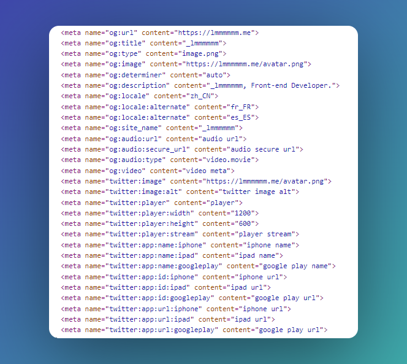

# vite-plugin-open-graph

[](https://github.com/Lmmmmmm-bb/vite-plugin-open-graph/blob/main/LICENSE)
[](https://github.com/Lmmmmmm-bb/vite-plugin-open-graph/releases)

Generate Open Graph meta tags for your Vite app.

## Install

```bash
npm i -D vite-plugin-open-graph
```

```ts
import { defineConfig } from 'vite'
import ogPlugin from 'vite-plugin-open-graph'

export default defineConfig({
  plugins: [
    ogPlugin({
      // your Open Graph information config
    })
  ],
})
```

<details>
<summary>Example</summary>

```ts
import { defineConfig } from 'vite'
import ogPlugin from 'vite-plugin-open-graph'
import type { Options } from 'vite-plugin-open-graph'

const ogOptions: Options = {
  basic: {
    url: 'https://lmmmmmm.me',
    title: '_lmmmmmm',
    type: 'image.png',
    image: 'https://lmmmmmm.me/avatar.png',
  },
  extra: {
    determiner: 'auto',
    description: '_lmmmmmm, Front-end Developer.',
    locale: 'zh_CN',
    localeAlternate: ['fr_FR', 'es_ES'],
    siteName: '_lmmmmmm',
    audio: {
      url: 'audio url',
      secureUrl: 'audio secure url',
      type: 'video.movie',
    },
    video: 'video meta',
  },
  twitter: {
    image: 'https://lmmmmmm.me/avatar.png',
    imageAlt: 'twitter image alt',
    player: 'player',
    playerWidth: 1200,
    playerHeight: 600,
    playerStream: 'player stream',
    app: {
      name: {
        iphone: 'iphone name',
        ipad: 'ipad name',
        googleplay: 'google play name',
      },
      id: {
        iphone: 'iphone url',
        ipad: 'ipad url',
        googleplay: 'google play url',
      },
      url: {
        iphone: 'iphone url',
        ipad: 'ipad url',
        googleplay: 'google play url',
      },
    },
  },
}

export default defineConfig({
  plugins: [ogPlugin(ogOptions)],
})
```

<p align="center">

</p>
</details>

## Types

You can consult the `.d.ts` file to see more descriptions of the fields when develop.

```ts
// Base Plugin Config
interface Options {
  basic: BasicOptions
  extra?: ExtraOptions
  twitter?: TwitterOptions
}

interface BasicOptions {
  title: string
  type: string
  image: string | ImageOptions
  url: string
}

interface ExtraOptions {
  description?: string
  determiner?: 'a' | 'an' | 'the' | 'auto' | ''
  locale?: string
  localeAlternate?: string[]
  siteName?: string
  video?: string | VideoOptions
}
```

```ts
interface ImageOptions {
  url?: string
  secureUrl?: string
  type?: string
  width?: number
  height?: number
  alt?: string
}

type VideoOptions = Omit<ImageOptions, 'alt'>
```

```ts
// Twitter Open Graph Options
interface TwitterOptions {
  card?: 'summary' | 'summary_large_image' | 'app' | 'player'
  site?: string
  siteId?: string
  creator?: string
  creatorId?: string
  description?: string
  title?: string
  image?: string
  imageAlt?: string
  player?: string
  playerWidth?: number
  playerHeight?: number
  playerStream?: string
  app?: {
    name?: {
      iphone?: string
      ipad?: string
      googleplay?: string
    }
    id?: {
      iphone?: string
      ipad?: string
      googleplay?: string
    }
    url?: {
      iphone?: string
      ipad?: string
      googleplay?: string
    }
  }
}
```
